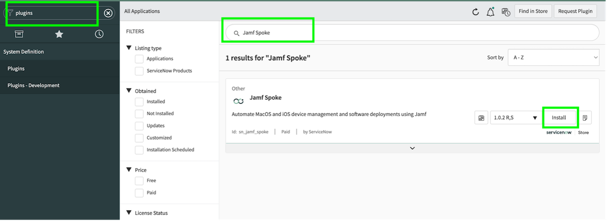
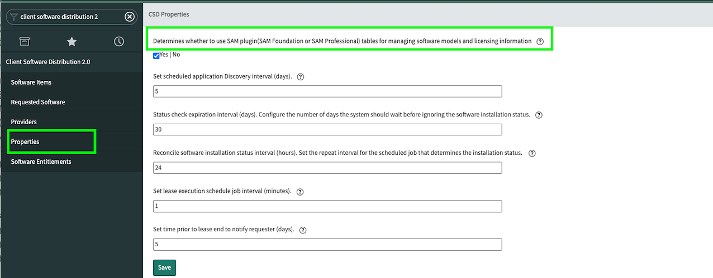
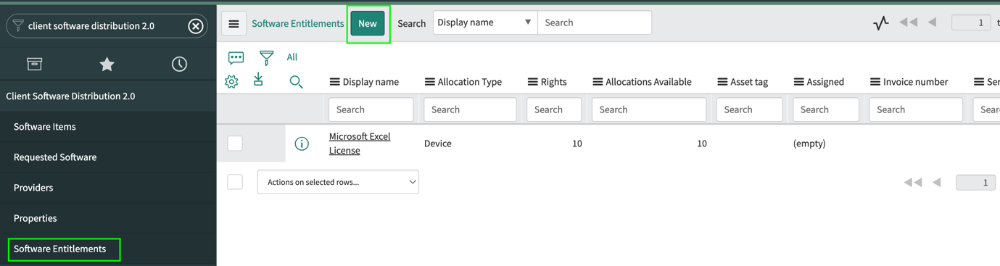

**Ignite IT service productivity with Client Software Distribution 2.0**

**Lab 1:**

**Overview:**

*Client Software Distribution 2.0* application (*CSD 2.0*) application
enables administrators to distribute software from the service catalog
using third-party management systems.

CSD 2.0 enables an administrator to create all the records necessary to
deploy software from service catalog requests, including software models
and catalog items.

You can use the CSD 2.0 application to automate the deployment and
revocation of software from a third-party software provider using the
custom flows. Deployment and revocation is accomplished using
provider-specific spoke flows, sub-flows, and actions. 

This lab guide will walk you through the process of using JAMF software
provider through CSD 2.0.

**Installation:**

1.  Navigate to Plugins from navigator.

2.  List of all available applications will be displayed.

3.  Search for "*Client Software Distribution 2.0*" and install it.
    Perform same action for "*Jamf Spoke*"

{width="6.263888888888889in"
height="1.8979166666666667in"}

{width="6.263888888888889in"
height="2.2916666666666665in"}

A successful installation displays following result:

{width="6.263888888888889in"
height="1.204569116360455in"}

CSD 2.0 Modules:

{width="6.263888888888889in"
height="1.9548611111111112in"}

Jamf Modules:

{width="6.263888888888889in"
height="1.8055555555555556in"}

**CSD 2.0 - JAMF Integration:**

Use the CSD 2.0 along with the Jamf spoke to deploy and revoke software
deployments from Jamf  server and manage distributions on hosts.

The Jamf spoke contains actions that CSD 2.0 uses to deploy software
from a service catalog request and manage user and device groups
on Jamf servers. In addition, CSD 2.0 can manage license counts for
deployed software, revoke software deployed by Jamf without user
interaction, and manage lease periods.

**Configuration Check:**

**Verify Provider record:**

Verify that the flows are configured correctly in the provider record.

a.  Navigate to **Client Software Distribution 2.0** \> **Providers**.

b.  Open the record **Jamf**.

> {width="5.9152045056867895in"
> height="1.5397889326334209in"}

c.  Verify that the flows are configured correctly in the record.

> {width="6.263888888888889in"
> height="1.7770833333333333in"}

**Note:** You can configure the default flows as per your requirement.

**Deciding license tables:**

CSD 2.0 enables you to use its own license tables or you can also
consume license information from SAM (Software Asset Management) tables.

Use the first property shown below to make your choice.

{width="6.263888888888889in"
height="2.7979166666666666in"}

Edit other properties as per requirement.

Software Asset Management (**SAM**) tables:

-   Software Entitlement (alm_license)

-   Software Model (cmdb_software_product_model)

Client Software Distribution 2.0 (**CSD 2.0**) tables:

-   Software Entitlement (sn_csd_license)

-   Software Model (sn_csd_software_product_model)

**Lab 2:**

**Setting up JAMF Spoke:**

Integrate the ServiceNow instance and Jamf instance using
the Jamf credential to authenticate ServiceNow requests.

**Role required:** admin

**Procedure:**

1.  Navigate to **Connections & Credentials** \> **Connection &
    Credential Aliases**.

2.  Open the record, **Jamf**.

> {width="6.263888888888889in"
> height="1.5581146106736659in"}

3.  Click the **Create New Connection & Credential** related link.

> {width="5.8410728346456695in"
> height="3.309078083989501in"}

4.  On the form, fill the required values.

5.  Click **Create**.

## Store details of the Jamf server:

## 

Create a server instance record to discover applications and store
details of the Jamf server.

**Role required:** admin

**Procedure**

1.  Navigate to **JAMF** \> **Server instances**.

2.  Click **New**.

> {width="6.263888888888889in"
> height="1.5472222222222223in"}

3.  On the form, fill the required values.

> {width="6.263888888888889in"
> height="1.0820713035870517in"}

4.  Right-click the form header and click **Submit**.

5.  Click the **Discover Now** related link to discover all applications
    and retrieve data from the server.

> {width="6.263888888888889in"
> height="1.4548611111111112in"}

6.  Discover and Store Data subflow is triggered. Data is retrieved and
    in stored in the Jamf tables.

**Note:** Currently, you can use only the default connection and
credential alias records that have been shipped along with the Jamf
Spoke.

Once subflow execution is complete, data should be populated in Jamf
spoke tables.

{width="6.263888888888889in"
height="2.7111111111111112in"}

Discovery subflow populates "*Applications*", "*Groups*" and
"*Policies*" from Jamf server. Verify it from Jamf Modules.

{width="6.465651793525809in"
height="1.7633595800524935in"}

**Licensing:**

Deciding license allocation type:

1.  If Group specified in Software Configuration (that is linked with
    catalog item) is of type **Mobile or**

**Computer**, the license check is performed on software entitlements
with **Allocation Type as Device**.

2.  If Group specified in Software Configuration (that is linked with
    catalog item) is of type **User**, the

license check is performed on software entitlements with **Allocation
Type as User.**

**Create licenses for distributed software using CSD 2.0:**

Licenses and software counters are associated with the software model
and must be

created if you want to track the license for software deployed by CSD
2.0.

**Role required:**

sn_csd.CSD Admin

You can create software licenses in CSD 2.0 for software items deployed

from the service catalog by CSD 2.0. If Allocations Available is greater
than 0, CSD 2.0 assumes that the license is available for the software.

**Procedure:**

1.  Navigate to **Client Software Distribution 2.0 \> Software
    Entitlements.**

2.  Click New.

{width="6.263888888888889in"
height="1.773611111111111in"}

3.  On the form, fill the required values.

{width="6.263888888888889in"
height="2.6458333333333335in"}

4.  Click Submit.

The license is created with the required rights.

**Note:** If SAM is used for licensing, make sure to create required
licenses in Software Entitlement(alm_license) table.

**Lab 3:**

**Configuring catalog item for an application:**

**Set up a software model:**

Using the applications discovered on the Jamf server, set up a software
model to manage licenses.

**Role required:** Ensure that the user has one of the two mentioned set
of roles.

-   sn_jamf_spoke.jamf_admin and sn_csd.CSD Admin

-   admin

You can link a Jamf application to an existing software model or create
a new model.

**Procedure:**

1.  If you are setting up a software model for the Jamf application,

> navigate to **Jamf \> Applications.**

A list of applications or policies discovered on the Jamf server
appears.

2.  Open the required record.

> {width="5.150585083114611in"
> height="2.1019181977252845in"}

3.  To link to an existing model, click the magnifying glass icon in the
    **CSD software**

> **Model(**while using CSD 2.0 license tables**)** field or **SAM
> software model(**while using SAM license tables**)** and select a
> model from the list.

Form view for SAM licensing:

{width="4.097952755905512in"
height="1.6968799212598424in"}

Form view for CSD 2.0 licensing:

{width="5.734620516185477in"
height="2.279861111111111in"}

4.  To create a model, click **Create Software Model** under related
    link.

5.  Complete the software model fields.

6.  Click **Submit.**

> The view returns to the Jamf Applications list.
>
> **Define the Jamf configuration:**
>
> Associate that software with a group through a Jamf configuration to
> create catalog
>
> items for Jamf software deployment or to configure your instance to
> revoke software
>
> through Jamf.
>
> **Role required:** sn_jamf_spoke.jamf_admin or admin
>
> The Jamf configuration process associates software with Jamf groups.
> To deploy
>
> software from a Jamf server, the user or device must be a member of a
> Jamf group
>
> associated with an install deployment. CSD 2.0 enables you to revoke
> unentitled
>
> software using the Jamf server when that software can be removed using
> the installation group by removing user or device from it.
>
> Users requesting revokable software from the Service Catalog also have
> the ability to define lease start and stop dates and request lease
> extensions.
>
> Perform these steps for the Jamf applications:

1.  After following '**Set up a Software Model'** instructions for a
    given application, click "New" in "**Configurations**" on the
    applications's form view or click "Create Software Configuration"
    from related links.

> {width="4.93347987751531in"
> height="1.965188101487314in"}

2.  On the form, fill the required values.

> {width="5.880847550306211in"
> height="1.039905949256343in"}

3.  Click Submit.

> **Create a catalog item for the Jamf application:**
>
> Create a catalog item for an application you want to offer for
> distribution from the
>
> service catalog using the applications discovered on the Jamf server.
>
> **Role required:** Ensure that the user has one of the two mentioned
> set of roles.

-   sn_jamf_spoke.jamf_admin, catalog_admin, and sn_csd.CSD Admin

-   admin

> **Procedure:**

1.  If you are creating a catalog item for the Jamf application,
    navigate to **Jamf \> Applications.**

2.  Open the required record.

3.  Click the **Create Catalog Item** related link.

> {width="3.8355260279965004in"
> height="1.884595363079615in"}

4.  On the form, fill the required values.

> {width="6.169642388451444in"
> height="4.385097331583552in"}

5.  Right-click the form header and click **Save**.

6.  In the **CSD Catalog Item Fulfillment Configuration** tab, open the
    default record and provide these values as per your requirement.

> {width="6.263888888888889in"
> height="3.361111111111111in"}

7.  Click Update.

> Catalog item is created and is available for ordering from Service
> Catalog.

8.  To see all CSD 2.0 catalog items, navigate to **Client Software
    Distribution 2.0** \> **Software Items**.

> **Note:** If you are unable to see any of the above fields or tabs,
> configure the table\'s form view or related lists accordingly.

**Deployment process**

Order an application from a CSD 2.0 catalog item in the service catalog
triggers the

**Order Client Software** flow.

This process deploys an application to a user or device through a
service catalog order:

1.  If the **Skip approval** check box is cleared in the software
    catalog item, the Order Client Software flow sends the catalog
    request to the requesting user\'s manager for approval.

2.  If the **Check license compliance** check box is selected in the
    software catalog item, the flow performs a software license check
    from SAM or CSD 2.0 depending on your configuration. If there is no
    license available, the flow creates a catalog task to procure more
    licenses and assigns the task to the CSD Administrators group.

3.  The Order Client Software flow triggers the **Deploy Client
    Software** flow that in turn triggers the provider-specific
    **Deployment Flow** that is specified in the provider record.

*Catalog item order view:*

{width="6.263888888888889in"
height="2.907638888888889in"}

**Note:** The device must have its serial number populated in the device
table.

**Lease start and end dates:**

All software deployed by CSD 2.0 requires users to specify the beginning
date for the

lease.

If the catalog item is configured for revocation (uninstall), the form
displays the Lease

end field, which allows the requester to define an end date and time for
the lease. The

system validates user input in these fields to ensure that the dates
selected define a

future window. The Lease end field is not mandatory and can be left
blank to order

software with no end date.

**Viewing Requested Software:**

Navigate to Client **Software Distribution 2.0 \> Requested Software.**

{width="6.967352362204724in"
height="1.7032163167104113in"}

**Bonus Lab:**

**Extending Software Lease:**

Users of software deployed by CSD 2.0 can request the extension of a
lease window, if

the software is revocable by a software distribution system.

Ensure that the user has one of the two mentioned set of roles.

-   itil and sn_csd.CSD Admin

-   itil and sn_csd.CSD User

**Procedure:**

1.  Navigate to **Client Software Distribution 2.0 \> Requested
    Software**. The list shows only the softwares you have requested
    from the service catalog.

2.  Select the record for the installed software whose lease you want to
    extend.

3.  Under Related Links, click **Extend Lease**

4.  In the dialog box that appears, select a new lease end date in the
    calendar and

> click **OK**. You must select a date later than the current date.

{width="5.55847987751531in"
height="2.807587489063867in"}

**Revoke Software:**

Request for revoking requested software will be automatically sent to
the Jamf server on the specified Lease End Date. You can follow below
steps to revoke it manually before that:

Ensure that the user has one of the two mentioned set of roles.

-   itil and sn_csd.CSD Admin

-   itil and sn_csd.CSD User

**Procedure:**

1.  Navigate to Client Software Distribution 2.0 \> Requested Software.
    The list shows only the softwares you have requested from the
    service catalog.

2.  Select the record for the installed software whose lease you want to
    extend.

3.  Under Related Links click **Revoke Software**

{width="5.492690288713911in"
height="1.5016601049868767in"}
